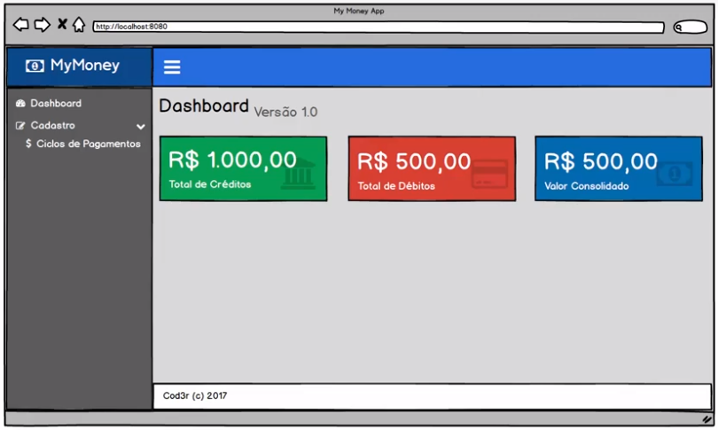
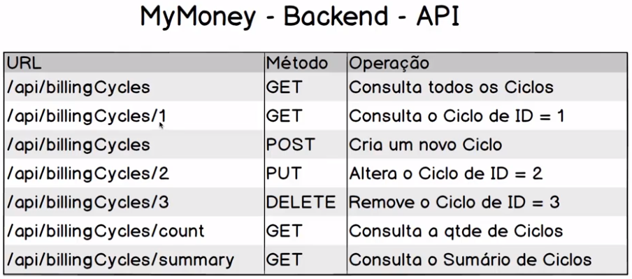
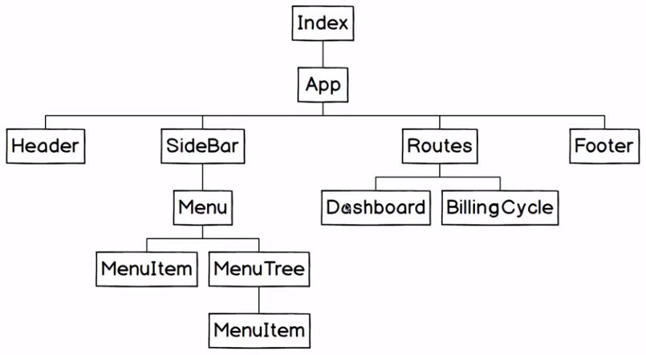
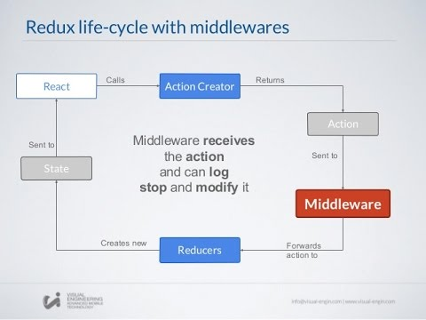
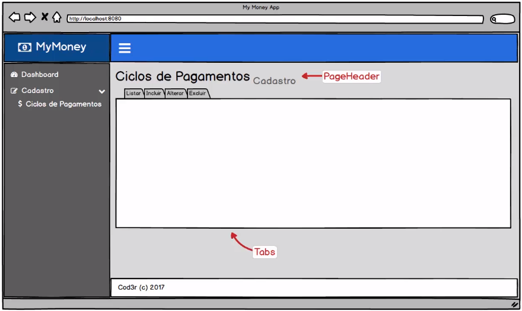
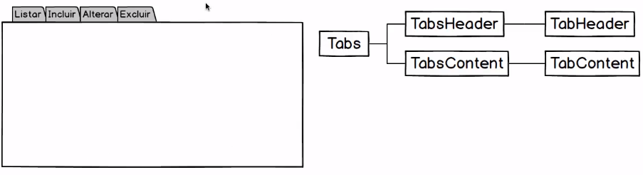

# curso-react-redux-cod3r
Material de estudo do curso "Curso React + Redux: Fundamentos e 2 Apps do Absoluto ZERO!" da COD3R na Udemy.

## Clonar o repositório do curso com os programas:
https://github.com/dantovsky/curso-react-redux-cod3r

## Entrar na pasta do programa

- npm install (instalar as dependencias)
- npm start (iniciar a app)

## Apps desenvolvidas no curso de React

### TodoApp


- Backend com PM2, Node Restful, Mongo, Mongoose.
- Frontend React.

Para rodar o projeto TodoApp:
- Rodar o MongoDB: 'sudo mongod' (ou: 'sudo mongod --port 27018')
- Rodar o backend: 'sudo npm run dev' from backend folder (ou: 'sudo npm run production' para rodar o PM2)
- Rodar o frontend: 'sudo npm run dev' from frontend folder

### Seção 8: Aplicação Final - Ciclos de Pagamentos (Backend)



Portas utilizadas:
- 3003 (backend)
- 8080 (frontend)

#### Tech utilizadas
- MongoDB
- Mongoose (mapeamento dos objetos para ser persistidos no MongoDB)
- Node Restful (módulo Node para construir webservices)
- Express (servidor web para rodar os webservices)
- Node

#### Estrutura de pastas
```
- my-money-app
    - backend (Node)
    - frontend (React)
```

#### MyMoney - Backend - API



GET, POST ciclos de pagamento: 
http://localhost:3004/api/billinCycles

GET quantidade de ciclos de pagamanto  
http://localhost:3004/api/billinCycles/count

GET so sumário de créditos e débitlos
http://localhost:3004/api/billinCycles/summary
```json
{
"credit": 18400,
"debt": 1619.12
}
```

#### Config backend

Criação do config.json
- npm init -y

Dependências
- npm i --save express@4.14.0 mongoose@4.7.0 body-parser@1.15.2 lodash@4.17.4 mongoose-paginate@5.0.3 express-query-int@1.0.1 node-restful@0.2.5 pm2@2.1.5

Dependências de desenvolvimento
- npm i --save-dev nodemon@1.11.0

#### Mapeamendo ODM (Obeto - Documento)

Mapeamento dos ciclos de pagamento para que possam ser persistidos na base de dados.


#### Mock data para testes

Postman » Body » x-www-form-urlencoded » Bulk Edit:  
POST :: http://localhost:3004/api/billinCycles

```
name: Janeiro/17
month: 1
year: 2017
credits[0][name]: Salario Empresa
credits[0][value]: 6500
credits[1][name]: Salario Professor
credits[1][value]: 2700
debts[0][name]: Telefone
debts[0][value]: 86.56
debts[0][status]:PAGO
debts[1][name]: Condomínio
debts[1][value]: 720
debts[1][status]:AGENDADOs
```

JSON Response (se inserção com sucesso)
```json
{
    "__v": 0,
    "name": "Janeiro/17",
    "month": 1,
    "year": 2017,
    "_id": "5fb1dbb9b789fa7a5d62c5cd",
    "debts": [
        {
            "name": "Telefone",
            "value": 86.56,
            "status": "PAGO",
            "_id": "5fb1dbb9b789fa7a5d62c5cf"
        },
        {
            "name": "Condomínio",
            "value": 720,
            "status": "AGENDADO",
            "_id": "5fb1dbb9b789fa7a5d62c5ce"
        }
    ],
    "credits": [
        {
            "name": "Salario Empresa",
            "value": 6500,
            "_id": "5fb1dbb9b789fa7a5d62c5d1"
        },
        {
            "name": "Salario Professor",
            "value": 2700,
            "_id": "5fb1dbb9b789fa7a5d62c5d0"
        }
    ]
}
```

PUT :: http://localhost:3004/api/billinCycles/:id (adicionar o _id como parametro na tab "Params", do Postman)

### Seção 9: Aplicação Final - Ciclos de Pagamentos (Frontend)

#### Componentes da App

")

#### Organização hierárquica dos componentes do sistema

O componente Index é o que colocamos como referẽncia na config do Webpack.



#### Instalação do frontend React e libs necessárias

```c
npm init -y
npm i --save-dev webpack@1.14.0 webpack-dev-server@1.16.2 -E
npm i --save-dev babel-core@6.22.1 babel-loader@6.2.10 babel-plugin-react-html-attrs@2.0.0 babel-plugin-transform-object-rest-spread@6.22.0 babel-preset-es2015@6.22.0 babel-preset-react@6.22.0 -E
npm i --save-dev extract-text-webpack-plugin@1.0.1 css-loader@0.26.1 style-loader@0.13.1 file-loader@0.9.0 -E
npm i --save-dev admin-lte@2.3.6 font-awesome@4.7.0 ionicons@3.0.0 -E
npm i --save-dev react@15.4.2 react-dom@15.4.2 react-router@3.0.2 redux@3.6.0 react-redux@4.4.6 redux-form@6.4.1 redux-multi@0.1.12 redux-promise@0.5.3 redux-thunk@2.1.0 react-redux-toastr@4.4.2 axios@0.15.3 lodash@4.17.4 -E
```

Além de colocar a versão fixa no comando, a flag -E garante que será instalada a versão exata.

#### Config do Webpack

```js
// Config que vai ser interpretada pelo Webpack
const webpack = require('webpack') // Import no padrão Commons JS
const ExtractTextPlugin = require('extract-text-webpack-plugin') // Responsável por extrair os files CSS e aplicar o processo com Style Loader e CSS Loader

module.exports = {
    entry: './src/index.jsx',
    output: {
        path: __dirname + '/public',
        filename: './app.js'
    },
    devServer: {
        port: 8080,
        contentBase: './public'
    },
    resolve: {
        extensions: ['', '.js', '.jsx'],
        alias: {
            modules: __dirname + '/node_modules',
            jquery: 'modules/admin-lte/plugins/jQuery/jquery-2.2.3.min.js',
            bootstrap: 'modules/admin-lte/bootstrap/js/bootstrap.js'
        }
    },
    plugins: [
        new webpack.ProvidePlugin({ // Deixar o jQuery disponivel
            $: 'jquery',
            jQuery: 'jquery',
            'window.jQuery': 'jquery'
        }),
        new ExtractTextPlugin('app.css') // Classe CSS que vai gerar
    ],
    module: {
        loaders: [{
            test: /.js[x]?$/, // Arquivos JavaScript
            loader: 'babel-loader',
            exclude: '/node_modules',
            query: {
                presets: ['es2015', 'react'], // Presets para passar pelos arquivos JS e JSX da app
                plugins: ['transform-object-rest-spread'] // Plugin que transforma os operadores spread da app, para fazer o transpile para a versão antiga do JS corretamente
            }
        }, {
            test: /\.css$/,
            loader: ExtractTextPlugin.extract('style-loader', 'css-loader')
        }, {
            test: /\.woff|.woff2|.ttf|eot|.svg|.png|.jpg*.*$/,
            loader: 'file'
        }]
    }
}
```
#### Redux Life-Cycle with Middlewares



#### Visão geral dos com componentes de abas

Componentes dentro do componente BillingCycles


Diagrama de herarquia dos componentes de abas


Código do BillinCycles com os componentes de abas
```jsx
import React, { Component } from 'react'

import ContentHeader from '../common/template/contentHeader';
import Content from '../common/template/content';
import Tabs from '../common/tab/tabs';
import TabsHeader from '../common/tab/tabsHeader';
import TabsContent from '../common/tab/tabsContent';
import TabHeader from '../common/tab/tabHeader';

class BillingCycle extends Component {
    render() {
        return (
            <div>
                <ContentHeader title="Ciclos de Pagamentos" small="cadastro" />
                <Content>
                    <Tabs>
                        <TabsHeader>
                            <TabHeader label="Listar" icon="bars" target="tabList" />
                            <TabHeader label="Incluir" icon="plus" target="tabCreate" />
                            <TabHeader label="Alterar" icon="pencil" target="tabUpdate" />
                            <TabHeader label="Excluir" icon="trash-o" target="tabDelete" />
                        </TabsHeader>
                        <TabsContent>
                            <p>...</p>
                        </TabsContent>
                    </Tabs>
                </Content>
            </div>
        );
    }
}

export default BillingCycle;

```